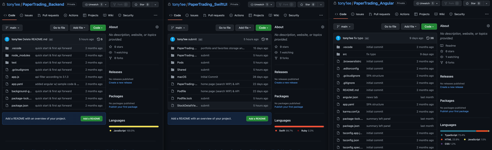

# PaperTrading
A cross platform stock trading simulator with real-time pricing, news, charts, and information
# Project Overview
## Backend Service
- API implementation (financial data powered by Finnhub) 
- Static content (html, js) hosting 
- Built with Express (Node.js)
- Deployed on Google App Engine
## Web Application
- Responsive single-page application (SPA)
- Built with Angular using TypeScript (JavaScript)
- Themed using Material Design
- Hosted on Google App Engine
## iOS Mobile Application
- SwiftUI app for iOS mobile devices written in Swift
# Demo
## Web app demo
### Responsive design

### AutoComplete

### Stock info

### News

### Historical Charts

### Stock insights

## iOS app demo
### Search and view stocks

### Trade stocks

### Portfolio and favorite management

### View peers

### View and share news

### View stock insights

### Dark mode support

# Source Code
Full source code is available upon request. Due to policy restriction, no public code repository is available.

